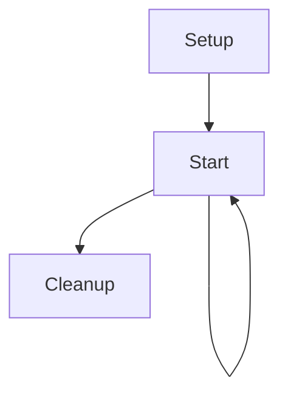

# InkBridge

This scriptable object takes care of processing an Ink story and implementing the various IStory* interfaces.

## Lifetime

The component takes advantage of the ScriptableObjectSetupSupport base class (
see https://blog.foxthesystem.space/posts/scriptable-object-domain-reload/).

In addition to the setup and cleanup phases, there's also another lifetime moment which is about when the ink story gets
loaded ("Start"). Because of this, the lifetime state machine is the following:



## Dependency Injection

`InkBridge` is a `ScriptableObject`, which means it won't be created by or directly involved in the dependency injection system.

Because of this, in order to provide it values and objects from the dependency injection system, the method `ContainerBuilderExtensions.RegisterInkBridgeInstance` method must be invoked in order to call the InkBridge `SetUp` method with data extracted from the container (e.g.: info from the save system).

## Save system

The save system automatically saves the current story state every `_minimumTimeBetweenAutomaticSaves` time (default: 5 minutes, provided in `SetUp` by the `ContainerBuilderExtensions.RegisterInkBridgeInstance` method, see [Dependency Injection](#dependency-injection)
), whenever the player enters a room or finish a conversation (which corresponds to the moment we get back to the main node in the ink story and face an `@interact`).

Saves are directories stored in `Application.persistentDataPath` (something link C:\Users\<user>\AppData\LocalLow\owof games\Selanìa: https://docs.unity3d.com/6000.4/Documentation/ScriptReference/Application-persistentDataPath.html ), all of which have a `_saveDirPrefix` prefix (also provided in `SetUp`) followed by an increasing number of 7 digits.

Inside the directory two files are saved:
- `savefile.json`: a json that contains the timestamp and the name of the current room the player is in
- `ink.json`: the json produced by Ink for the save state

Whenever a save file is produced, the system checks if it can remove old save files. Two criteria are checked to remove a save file, and both must pass before a save file is removed:
- there must be at least `_minimumNumberOfRetainedSaves` save files
- the save file to remove is older than the current one of at least `_minimumTimeSpanOfSavesRetained`

Both these parameters are passed once again through `SetUp`.

The interface `IStoryStateSerializer` is implemented to offer methods that return all available save states (GetSaveStates) and load a story / start a new story (StartStory).

## Grimoire page changes detection

In order to detect when the grimoire changes, InkBridge visits the grimoire node and all its children using depth-first search, and saves a tree structure of the nodes visited (a node is defined by all the stuff from the start of a text until the set of choices). The nodes that point to previous, next and back are taken into consideration but not considered during navigation: this ensures the nodes can be serialized as a tree.

Whenever needed (new room? conversation ended? every line of text?), the grimoire is re-visited, and the new data structure is compared with the previous one. Whenever a node has changed, it's marked as such. Then, a `GrimoireChanged` observable event is raised.

It's possible to ask if a node (or any child) has changed (in order to show the change marker), and mark a node as seen (which removes the changed flag).

The structure of the grimoire is visited by running a depth-first search, but contrary to standard DFS, we must follow the link (choices) provided by Ink in order to run along the tree of the grimoire. In order to do this, instead of using a stack, we remember which children we visited of each node, and the algorithm looks something like this:

```
visitedChoicesByNode = {}

loop:
choice = first choice "c" in currentChoices such that:
    it's not a navigation link (a choice tagged with "bookmark:<something>"), and
    visitedChoicesByNode[currentNode] does not contain c
if you found one:
    add choice to visitedChoicesByNode[currentNode]
    take choice
    go to loop
else if there's a navigation link to go back
    take choice
    go to loop
else
    end the algorithm
```

This avoids using the stack of DFS, but we have instead a map from nodes to list of nodes.

Note well: we currently have loops in this tree, in form of nodes linking to themselves (text nodes). Because of this, some extra checks are needed.