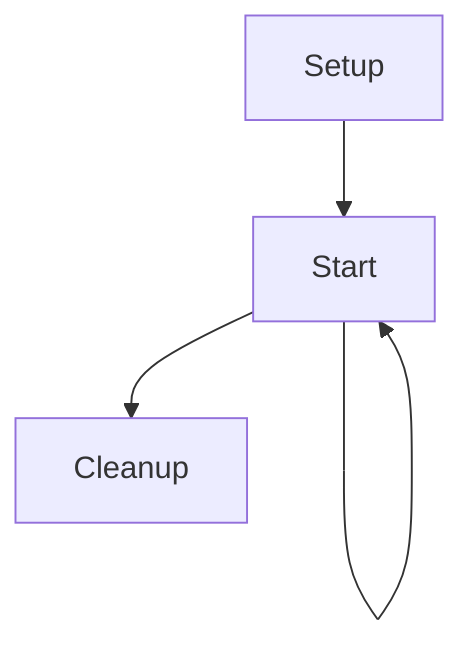

# InkBridge

This scriptable object takes care of processing an Ink story and implementing the various IStory* interfaces.

## Lifetime

The component takes advantage of the ScriptableObjectSetupSupport base class (
see https://blog.foxthesystem.space/posts/scriptable-object-domain-reload/).

In addition to the setup and cleanup phases, there's also another lifetime moment which is about when the ink story gets
loaded ("Start"). Because of this, the lifetime state machine is the following:

## Dependency Injection

`InkBridge` is a `ScriptableObject`, which means it won't be created by or directly involved in the dependency injection system.

Because of this, in order to provide it values and objects from the dependency injection system, the method `ContainerBuilderExtensions.RegisterInkBridgeInstance` method must be invoked in order to call the InkBridge `SetUp` method with data extracted from the container (e.g.: info from the save system).

## Save system

The save system automatically saves the current story state every `_minimumTimeBetweenAutomaticSaves` time (default: 5 minutes, provided in `SetUp` by the `ContainerBuilderExtensions.RegisterInkBridgeInstance` method, see [Dependency Injection](#dependency-injection)
), whenever the player enters a room or finish a conversation (which corresponds to the moment we get back to the main node in the ink story and face an `@interact`).

Saves are directories stored in `Application.persistentDataPath` (something link C:\Users\<user>\AppData\LocalLow\owof games\Selanìa: https://docs.unity3d.com/6000.4/Documentation/ScriptReference/Application-persistentDataPath.html ), all of which have a `_saveDirPrefix` prefix (also provided in `SetUp`) followed by an increasing number of 7 digits.

Inside the directory two files are saved:
- `savefile.json`: a json that contains the timestamp and the name of the current room the player is in
- `ink.json`: the json produced by Ink for the save state

Whenever a save file is produced, the system checks if it can remove old save files. Two criteria are checked to remove a save file, and both must pass before a save file is removed:
- there must be at least `_minimumNumberOfRetainedSaves` save files
- the save file to remove is older than the current one of at least `_minimumTimeSpanOfSavesRetained`

Both these parameters are passed once again through `SetUp`.

The interface `IStoryStateSerializer` is implemented to offer methods that return all available save states (GetSaveStates) and load a story / start a new story (StartStory).