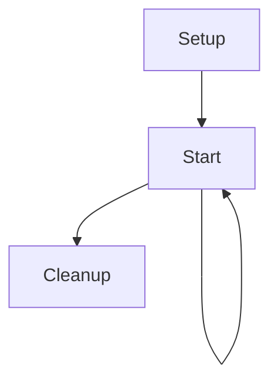

# InkBridge

This scriptable object takes care of processing an Ink story and implementing the various IStory* interfaces.

## Lifetime

The component takes advance of the ScriptableObjectSetupSupport base class (
see https://blog.foxthesystem.space/posts/scriptable-object-domain-reload/).

In addition to the setup and cleanup phases, there's also another lifetime moment which is about when the ink story gets
loaded ("Start"). Because of this, the lifetime state machine is the following:

